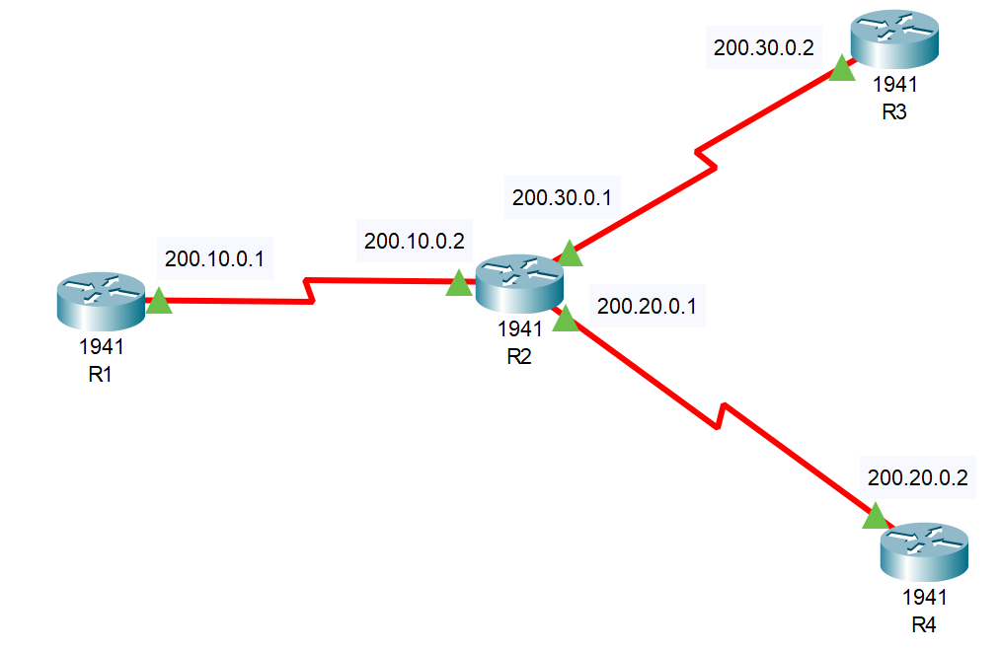

## 1. Configurar as Interfaces Serial em Cada Roteador



### Configuração do R1
```plaintext
enable
configure terminal
interface Serial0/1/0
ip address 200.10.0.1 255.255.255.0
clock rate 64000
no shutdown
exit
```

### Configuração do R2
```plaintext
enable
configure terminal
interface Serial0/1/0
ip address 200.10.0.2 255.255.255.0
no shutdown
exit

interface Serial0/1/1
ip address 200.30.0.1 255.255.255.0
clock rate 64000
no shutdown
exit

interface Serial0/0/0
ip address 200.20.0.1 255.255.255.0
clock rate 64000
no shutdown
exit
```

### Configuração do R3
```plaintext
enable
configure terminal
interface Serial0/1/1
ip address 200.30.0.2 255.255.255.0
no shutdown
exit
```

### Configuração do R4
```plaintext
enable
configure terminal
interface Serial0/0/0
ip address 200.20.0.2 255.255.255.0
no shutdown
exit
```

## 2. Configurar o RIP em Cada Roteador

### Configuração do R1
```plaintext
router rip
version 2
network 200.10.0.0
no auto-summary
exit
```

### Configuração do R2
```plaintext
router rip
version 2
network 200.10.0.0
network 200.20.0.0
network 200.30.0.0
no auto-summary
exit
```

### Configuração do R3
```plaintext
router rip
version 2
network 200.30.0.0
no auto-summary
exit
```

### Configuração do R4
```plaintext
router rip
version 2
network 200.20.0.0
no auto-summary
exit
```

## 3. Salvar as Configurações em Todos os Roteadores
Para garantir que a configuração seja mantida após reinicializações:
```plaintext
write memory
```

## 4. Testar a Configuração
Verificar as Rotas em Cada Roteador: Use o comando:
```plaintext
show ip route
```

## 5. Verificar as Atualizações do RIP: Em qualquer roteador, use:
```plaintext
debug ip rip
```
